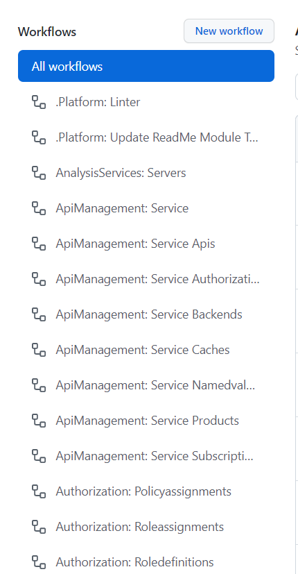

# Pipelines Usage

This section gives you an overview of how to interact with the repository pipelines.

# Overview

The goal of the "Produce Component" stage is to provide a safe environment the validate and produce production-ready Modules. The "Produce Component" stage consists of a Components repository (for storing the code), Module validation pipelines (to test the code offline & online and to run a validation deployment), and a "Sandbox" or "Engineering" validation subscription (in Azure) that doesn't have connectivity to any on-premises resources or other Azure networks and that is only used to validate that the Modules (or other components) are deployable.

# Resource Modules

The ResourceModules repository holds a set of reusable Module templates for the different Azure resource types, for example Log Analytics workspace or Automation Account. Every Module or component is built to be as much independent as possible from others. For some use cases you may need to have some already deployed resource (e.g. a virtual network before deploying a virtual machine or a Log Analytics workspace to enable logging). When an "external" resource is required, it will be reflected in the parameters, usually making it clearly understandable.


# GitHub workflow

Its a configurable collection multiple jobs which are tightly coupled together to deliver common result. YAML file must be created to define your workflow configuration.

Workflow files use YAML syntax, and must have either a .yml or .yaml file extension. Workflow files must be stored in `.github/workflows` directory in the repository to have it working.

# WorkFlow Name Structure

Naming convention Pipeline in the repository are structured via the module's main resource provider (for example `Microsoft.Web`) where each section of the path corresponds to its place in the hierarchy. However, for cases that do not fit into this schema we provide the following guidance:

Pipeline in the repository are structured via module's main resource provider (for example `ms.eventgrid`) and the followed by name of the module plus file name  (for example `topics.yml`)


``` txt
ResourceModules
└─ .github
    ├─ workflows
    |  ├─ ms.analysisservices.servers.yml
    |  └─ ms.apimanagement.service.authorizationservers.yml
    |  ├─ ms.apimanagement.service.backends.yml
    |

```

# How to Use pipeline for Deployment

All the workflow files must be stored in `.github/workflows` directory in the repository to have it working.


To "build" the modules, a dedicated pipeline is used for each module to validate their production readiness, by:

1. **Validate**:
   1. Running a set of static Pester tests against the template
   1. Validating the template by invoking Azure’s validation API (Test-AzResourceGroupDeployment – or the same for other scopes)
1. **Test deployment**: we deploy each module by using a pre-defined set of parameters to a ‘sandbox’ subscription in Azure to see if it’s really working
1. **Publish**: the proven results are copied/published to a configured location such as template specs, the bicep registry, Azure DevOps artifacts, etc.
1. **Removal**: The test suite is cleaned up by removing all deployed test resources again

Using this flow, validated modules can be consumed by other any consumer / template / orchestration to deploy an workload, solution, environment or landing zone.

# Parameters explanation

1. **Input Parameters**: Input parameters allow you to specify data that the action expects to use during runtime.

```yml
on:
  workflow_dispatch:
    inputs:
      removeDeployment:
        description: 'Remove deployed module'
        required: false
        default: 'true'
      versioningOption:
        description: 'The mode to handle the version increments [major|minor|patch|custom]'
        required: false
        default: 'patch'
      customVersion:
        description: 'The version to enforce if [versionOption] is set to [custom]'
        required: false
        default: '0.0.1'
  push:
    branches:
      - main
    paths:
      - '.github/actions/templates/**'
      - '.github/workflows/ms.eventgrid.topics.yml'
      - 'arm/Microsoft.EventGrid/topics/**'
      - '!arm/Microsoft.EventGrid/topics/readme.md'
```
**Remove deployed module** : Once the Deployment test completes whether it should remove the resource or keep it.

**The mode to handle the version increments [major|minor|patch|custom]**: Provide a custom version inside the module's pipeline file that is higher than the latest version available in the artifacts target location

**The version to enforce if [versionOption] is set to [custom]**: Provide a custom version when triggering the pipeline using the UI

Regardless of your particular use case, the pipeline will evaluate the given options in the above order. That means:

If you provide a custom module version in the UI, the pipeline's publish stage will always try to use it.
If it's not provided, the pipeline's publish stage will try to evaluate the currently available custom module version in the module's pipeline.yml file (pipelineCustomVersion).
If it's higher than the latest version available in the target location (storage account / artifacts feed) it will try to use it.
If it's not, the pipeline's publish stage defaults to the remaining option and increments either the patch, minor or major version number when publishing to the target location.

2. **Secret information**: The secrete which is create previously will be called here. This are environment specific variables (like the service connection to use for a given deployment)

```yml
env:
  moduleName: 'topics'
  modulePath: 'arm/Microsoft.EventGrid/topics'
  workflowPath: '.github/workflows/ms.eventgrid.topics.yml'
  AZURE_CREDENTIALS: ${{ secrets.AZURE_CREDENTIALS }}
  ARM_SUBSCRIPTION_ID: ${{ secrets.ARM_SUBSCRIPTION_ID }}
  ARM_MGMTGROUP_ID: ${{ secrets.ARM_MGMTGROUP_ID }}

```

3. **Setting up environment variable**: All the environment variable will be stored in a separate `json` format file location `.github\variables\variables.module.json`

```json
{
    "variables": [
        {
            "name": "defaultLocation",
            "value": "WestEurope"
        },
        {
            "name": "resourceGroupName",
            "value": "validation-rg"
        },
        {
            "name": "componentTemplateSpecRGName",
            "value": "artifacts-rg"
        },
        {
            "name": "componentTemplateSpecRGLocation",
            "value": "WestEurope"
        },
        {
            "name": "componentTemplateSpecDescription",
            "value": "components"
        },
        {
            "name": "publishToTemplateSpec",
            "value": "true"
        }
    ]
}
```

Any variable in the module yml starts with `env:` is referencing to `variables.module.json`

# Initiate the workflow

1. Browse to variable `json` file `variables.module.json` to update deployment information

    * defaultLocation
    * resourceGroupName
    * componentTemplateSpecRGName
    * componentTemplateSpecRGLocation
    * componentTemplateSpecDescription
    * publishToTemplateSpec

2. Now, Browse back to `yml` pipeline to initiate the trigger, location `.github/workflows`.

 
3. Select the workflow that need to be initialted and click on `Run workflow`. This will prompt with the input parameter.
    * Trigger from branch name.
    * Remove deployed module
    * The mode to handle the version increments [major|minor|patch|custom]
    * The version to enforce if [versionOption] is set to [custom]


4. This will trigger below workflow jobs in sequence.

```
    Jobs:
     - Run global module tests
     - Run global API module tests
     - Run deployment validation module tests (parameters.json)
     - Deploy module (parameters.json)
     - Publish module
     - Publish module
```


